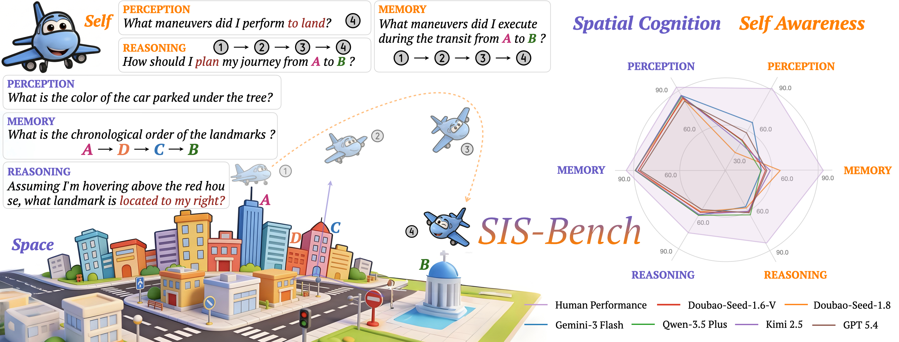
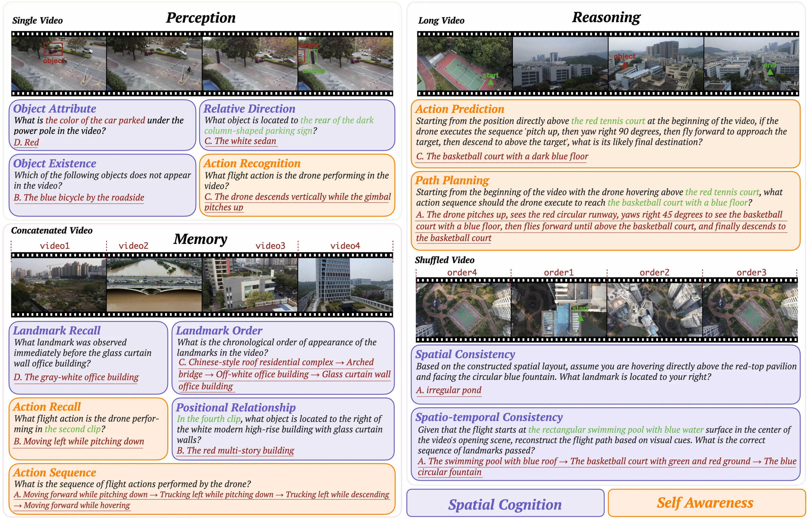
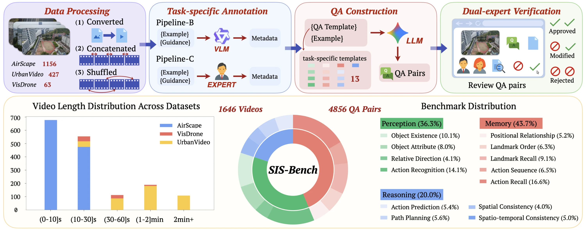
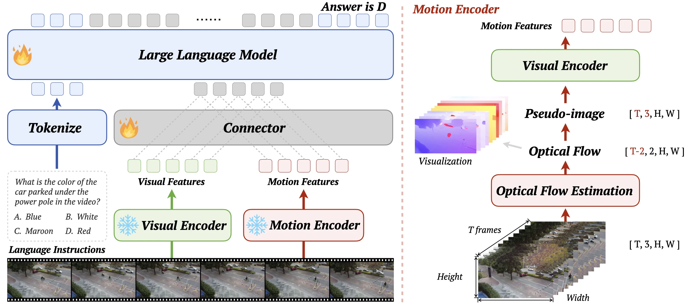

<div align="center">

# ✨Self-in-Space✨: Benchmarking Self-Awareness and Spatial Cognition in UAV Embodied Intelligence

<p align="center">
    <a href="https://choucisan.github.io">Zhishan Zou</a><sup>1</sup>,
    <a href="https://github.com/sunguoyan17-alt">Guoyan Sun</a><sup>1</sup>,
    <a href="https://trentonwei.github.io">Zhiwei Wei</a><sup>2</sup>,
    <a href="https://jianchengpan.space">Jiancheng Pan</a><sup>3</sup>,
    <a href="https://github.com/Davidup1">Yujie Li</a><sup>1</sup>,
    <a href="https://teacher.bupt.edu.cn/pengmugen/zh_CN/index.htm">Mugen Peng</a><sup>1</sup>,
    <a href="https://teacher.bupt.edu.cn/xuwenjia/zh_CN/index.htm">Wenjia Xu</a><sup>1&dagger;</sup>
    <br>
    <sup>&dagger;</sup>Corresponding author
    <br>
    <sup>1</sup>Beijing University of Posts and Telecommunications &nbsp;
    <sup>2</sup>Hunan Normal University &nbsp;
    <sup>3</sup>Tsinghua University
    <br>
    ACM MM 2026
</p>

<a href="https://arxiv.org"></a> &nbsp;
<a href="https://choucisan.github.io/publications/self-in-space"></a> &nbsp;
<a href="https://github.com/IntelliSensing/Self-in-Space"></a> &nbsp;
<a href="https://huggingface.co/datasets/choucsan/SIS-Bench"></a> &nbsp;
<a href="https://www.modelscope.cn/collections/choucisan/Self-in-Space"></a> &nbsp;
<a href="https://choosealicense.com/licenses/apache-2.0"></a>



</div>

<strong>Self-in-Space:</strong> We study spatial intelligence in embodied UAV scenarios from two complementary perspectives — <strong>Space</strong> and <strong>Self</strong>. We introduce SIS-Bench, SIS-Motion-54K, and SIS-Motion a benchmark, a training dataset, and a motion-aware model for spatial reasoning.


## 📢 News
<!-- * 🔥 [2026/7/16] Our [paper](https://arxiv.org) is available on arXiv. -->
* 😊 [2026/7/13] We release our benchmarking dataset [SIS-Bench](https://huggingface.co/datasets/choucsan/SIS-Bench) on HuggingFace.
* 😊 [2026/7/13] We release our training dataset [SIS-Motion-54K](https://huggingface.co/datasets/choucsan/SIS-Motion-54K) on HuggingFace.
* 😊 [2026/7/13] We release our 
downstream task dataset [OpenUAV-QA](https://huggingface.co/datasets/choucsan/OpenUAV-QA) on HuggingFace.
* 😊 [2026/7/13] We release our model [SIS-Motion](https://huggingface.co/choucsan/SIS-Motion) on HuggingFace.
* 🎉 [2026/7/10] Our paper is accepted by ACM MM 2026!

## 🌟 Overview

### 🍏 SIS-Bench

<strong>SIS-Bench:</strong> We introduce a benchmark of 4,856 QA pairs from 1,646 real-world UAV videos, evaluating embodied spatial intelligence across two dimensions (spatial cognition and self-awareness) and three cognitive levels (perception, memory, and reasoning).

### 🏗️ pipeline

<strong>Pipeline:</strong> SIS-Bench is built through a four-stage task-conditioned protocol: heterogeneous video processing, task-specific annotation, LLM-assisted QA construction, and dual-expert verification, ensuring scalability and reliability across 13 tasks.


### ✈️ SIS-Motion

<strong>SIS-Motion:</strong> A motion-aware extension of a video MLLM that fuses optical-flow-based motion cues with visual features, jointly capturing environmental context and agent dynamics to improve both spatial cognition and self-awareness.


## ⚙️ Getting Started

### 🎲 Clone

```bash
git clone https://github.com/IntelliSensing/Self-in-Space.git
cd Self-in-Space
```

### 🎹 Installation

The project requires Python 3.10, PyTorch 2.6 / CUDA 12.4, and an NVIDIA GPU with a compatible driver. Evaluation and training use separate environments (vLLM vs. Transformers). Both Conda and uv are supported.

With Conda:

```bash
# Install one or more profiles
bash scripts/setup_conda.sh eval      # vLLM evaluation → conda env: sis-motion-eval
bash scripts/setup_conda.sh lora      # LoRA training/eval → conda env: sis-motion-lora
bash scripts/setup_conda.sh motion    # SIS-Motion training/eval → conda env: sis-motion-motion

conda activate sis-motion-motion
```

With [uv](https://docs.astral.sh/uv/):

```bash
bash scripts/setup_uv.sh eval         # → .venv-eval/
bash scripts/setup_uv.sh lora         # → .venv-lora/
bash scripts/setup_uv.sh motion       # → .venv-motion/

source .venv-motion/bin/activate
```

| Environment | Purpose | Key Components | FlashAttn |
|---|---|---|---|
| eval | vLLM inference benchmark | vllm==0.8.5, torch==2.6.0+cu124 | No |
| lora | LoRA training + Transformers eval | deepspeed, peft, flash-attn | Yes |
| motion | SIS-Motion training + eval | deepspeed, peft, flash-attn, VideoFlow | Yes |

To use a different CUDA stack, edit the definitions under `environments/` directly.

### 📊 Data Preparation

All data paths are defined in [`configs/data_registry.json`](configs/data_registry.json) and resolve to `data/` by default.

```bash
# Download all datasets
python scripts/download_data.py

# Or download selectively
python scripts/download_data.py sis_bench
python scripts/download_data.py sis_motion_54k
python scripts/download_data.py openuav_qa
```

For an external data directory:

```bash
export SIS_DATA_ROOT=/path/to/self-in-space-data
python scripts/data_registry.py validate
```

Expected layout after download:

```text
data/
├── SIS-Bench/
│   ├── SIS-Bench.jsonl              # 4,856 QA pairs
│   └── video/
│       ├── AirScape/                # 1,156 videos
│       ├── UrbanVideo/              # 427 videos
│       └── VisDrone/                # 63 videos
├── SIS-Motion-54K/
│   ├── SIS-Motion-54K.jsonl
│   └── AirScape_dataset/            # training videos
├── OpenUAV-QA/
│   ├── TravelUAV_test.jsonl         # 3,895 QA pairs
│   └── TravelUAV_dataset/           # frame sequences
└── checkpoints/
    └── VideoFlow/
        └── MOF_kitti.pth
```

### 📊 Benchmark Evaluation (vLLM)

Evaluate any vLLM-supported video MLLM on SIS-Bench:

```bash
conda activate sis-motion-eval

MODEL_ID=Qwen/Qwen2.5-VL-3B-Instruct \
TENSOR_PARALLEL_SIZE=1 \
bash scripts/eval.sh
```

Change `MODEL_ID` and `TENSOR_PARALLEL_SIZE` for different models and GPU counts. Use `DATA_FILE` and `FRAMES_DIR` to evaluate an unregistered local dataset.

> **Note**: vLLM and Flash Attention version differences may lead to inconsistent evaluation results. Ensure all models under comparison are evaluated in the same environment.

### 🚀 LoRA Baseline Training

Fine-tune visual-only LoRA adapters on SIS-Motion-54K:

```bash
conda activate sis-motion-lora

DATASET_USE=sis_motion_54k \
OUTPUT_DIR=$PWD/lora/output/qwen3vl-4b-lora \
bash scripts/train_lora.sh
```

Defaults to `Qwen/Qwen3-VL-4B-Instruct`. Override with `MODEL_NAME_OR_PATH`. Uses DeepSpeed ZeRO-2 on 2 GPUs.

### 📊 LoRA Baseline Evaluation

Evaluate the trained LoRA checkpoint:

```bash
conda activate sis-motion-lora

MODEL_PATH=$PWD/lora/output/qwen3vl-4b-lora \
bash scripts/eval_lora.sh
```

### 🚀 SIS-Motion Training

First, download the VideoFlow checkpoint from [VideoFlow](https://github.com/XiaoyuShi97/VideoFlow) and place `MOF_kitti.pth` under `checkpoints/VideoFlow/`.

Train the full motion-aware model (frozen VideoFlow + trainable connector + LoRA):

```bash
conda activate sis-motion-motion

DATASET_USE=sis_motion_54k \
PRETRAINED_MODEL_NAME_OR_PATH=Qwen/Qwen2.5-VL-7B-Instruct \
OUTPUT_DIR=$PWD/motion/output/sis-motion \
bash scripts/train_motion.sh
```

The training script auto-detects `MOF_kitti.pth` from `checkpoints/VideoFlow/`. Set `VIDEOFLOW_CKPT` to override. Uses DeepSpeed ZeRO-2 on 3 GPUs.

For SwanLab experiment tracking:

```bash
SWANLAB_ENABLED=1 bash scripts/train_motion.sh
```

### 📊 SIS-Motion Evaluation

Ensure the SIS-Motion model package is placed under `model/` (or available on Hugging Face):

```bash
conda activate sis-motion-motion

# From Hugging Face
MODEL_PATH=choucsan/SIS-Motion \
bash scripts/eval_motion.sh

# Local model/ directory (auto-detected)
bash scripts/eval_motion.sh

# Training output (auto-detects latest checkpoint)
MODEL_DIR=$PWD/motion/output/sis-motion \
bash scripts/eval_motion.sh
```

The evaluator reads `base_model_name_or_path` from `adapter_config.json` and downloads the Qwen2.5-VL-7B base weights automatically.

### 📊 Downstream Evaluation (OpenUAV-QA)

```bash
# LoRA baseline
BENCHMARK=openuav_qa \
MODEL_PATH=Qwen/Qwen3-VL-4B-Instruct \
bash scripts/eval_lora.sh

# SIS-Motion
BENCHMARK=openuav_qa \
MODEL_PATH=choucsan/SIS-Motion \
bash scripts/eval_motion.sh
```

> **Note**: The paper pre-processes videos with the same sampling strategy as Qwen2.5-VL to reduce GPU memory pressure. See the paper appendix for details. This codebase reproduces the paper setting only; using raw MP4 inputs may introduce discrepancies. Use a consistent input format when comparing against baselines.


## 📚 Citation

The paper citation will be added after the arXiv paper release.


## 📖 References and Acknowledgements

This project builds on the following open-source models, libraries, and data
resources:

- **Code**: [Qwen-VL](https://github.com/QwenLM/Qwen3-VL),
  [Spatial-MLLM](https://github.com/THU-SI/Spatial-MLLM),
  [VideoFlow](https://github.com/XiaoyuShi97/VideoFlow)
- **Infra**: [vLLM](https://github.com/vllm-project/vllm),
  [Transformers](https://github.com/huggingface/transformers),
  [PEFT](https://github.com/huggingface/peft),
  [DeepSpeed](https://github.com/deepspeedai/DeepSpeed)
- **Data**: [AirScape](https://huggingface.co/datasets/EmbodiedCity/AirScape-Dataset),
  [UrbanVideo-Bench](https://huggingface.co/datasets/EmbodiedCity/UrbanVideo-Bench),
  [VisDrone](https://github.com/VisDrone/VisDrone-Dataset),
  [OpenUAV](https://github.com/prince687028/TravelUAV)


## 📮 Contact

For questions, corrections, or collaboration requests:

[choucisan@gmail.com](mailto:choucisan@gmail.com)